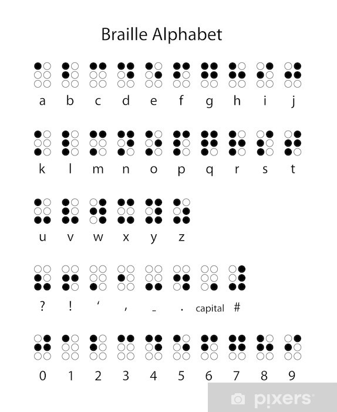

# Glovraille
## Introduction
Gloveraille is a glove that act as a  braille keyboard that is based on an arduino board. 

## Concept
The concept is verry simple, as shown in the figure bellow, the user will type a character using the selector and the character zone, when the user finish typing the character, he can confirm weither it is a number or character using one of the options in the forth finger, the character is then sent to the connected device (computer, phone or other compaptible device) after confirmation. The user can also send space, delete, enter or correct.
The glovebraille consists of 10 pads, 6 for character input, 3 for diffrent options and one pad as a selector. The role of each pad is as follow:
* pad number 0: the selector
* pads from 1 to 6 : character zone, this pads will construct the character
* pad 7: When this pad is selected using the selector, if the user already taped a character, it will confirm the **character** and sent it to the connected device. Otherwise, if the user did not enter any character, this will send a **space** to the device.
* pad 8: When this pad is selected using the selector, if the user already taped a character, it will confirm the **number** and sent it to the connected device. Otherwise, if the user did not enter any character, this will send a **return character**   to the device.
* pad 9: When this pad is selected using the selector, if the user already taped a character, it will correct the character, in other words, this action will clear the chararcter buffer and does not send anything to the connected device. Otherwise, if the user did not enter a character, this will send a **deletec character** to the device.

The braille alphabet suported now is presented in the folowing figure:

### proof of concept

