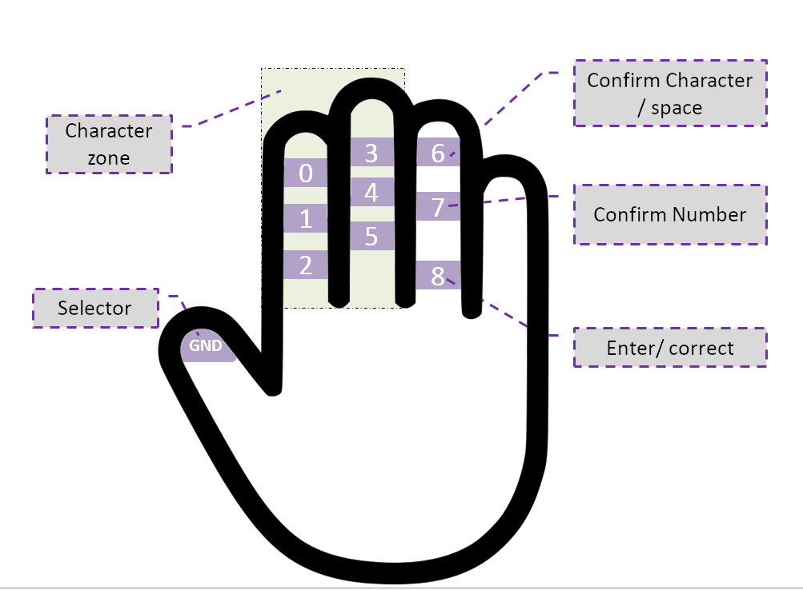

# Glovraille

## Outline
1. [Introduction](#introduction)
2. [Concept](#concept)
3. [Proof of concept (version 1)](#proof-of-concept)
4. [Build process (version 2)](#build-process-version-1)
3. [Proof of concept (version 2)](#proof-of-concept-version-2)

## Introduction

Glovraille is a glove that acts as a braille keyboard that is based on an Arduino board. 

## Concept

The concept is very simple, as shown in the figure bellow, the user will type a character using the selector and the character zone, when the user finish typing the character, he can confirm whether it is a number or character using one of the options in the fourth finger, the character is then sent to the connected device (computer, phone or other compatible device) after confirmation. The user can also send space, delete, enter or correct.
The Glovraille consists of 10 pads, 6 for character input, 3 for different options and one pad as a selector. The role of each pad is as follow:
* Pad GND : the selector ( connected to GND pin of the Arduino)
* Pads from 0 to 5 : character zone, this pads will construct the character (Arduino pins; 2,3,4,5,6 and 7).
* pad 6: When this pad is selected using the selector, if the user already taped a character, it will confirm the **character** and sent it to the connected device. Otherwise, if the user did not enter any character, this will send a **space** to the device. (Pin 11 in the Arduino).
* pad 7: When this pad is selected using the selector, if the user already taped a character, it will confirm the **number** and sent it to the connected device. (Pin 12 in the Arduino).
* pad 8: When this pad is selected using the selector, if the user already taped a character, it will correct the character, in other words, this action will clear the character buffer and does not send anything to the connected device.  Otherwise, if the user did not enter any character, this will send a **return character**   to the device. (Pin 13 of the Arduino).

The braille alphabet supported now is presented in the following figure:

 

## Proof of concept
The first prototype is made from a simple glove, with aluminum foil stick to the glove using double tape. For connection, wires from a headphone are used for their flexibility.

The ideal is to have instead of aluminum foil a conductive textile, however, I cannot find any and it will take long time to arrive if ordered from elsewhere. Also, instead of aluminum foil and double side tape, there is aluminum tape, but that what I have at the moment of making this prototype. For wires, there is also some kind of conductive thread, but for the same reasons mentioned before, I used wires from and old headphone.

Here is a short video of the prototype in action:

## Build process (version 2)
To build the Glovraille you need the flowing tools:
* A glove
* Arduino pro-mini (or any other Arduino)
* FTDI (if you are using an Arduino pro-mini)
* Headphone wires (thin wires that are inside the headphone cable)
* Conductive thread (if you don't have a conductive thread, you can use the headphone wires or aluminum tape as in version 1)
* Normal thread (optional)

i. The first step is to solder the headphone wires to the Arduino pins (for simplicity, I used the pins 2,3,4,5,6,7 for letters, and 11,12,13 for function buttons).

ii. Add the headphone wires to the glove using a needle.

iii. Add the conductive thread: I'm not good at sewing, so I tried to have a big surface of the conductive thread, also, I tried different shapes, but they all work fine.

iv. Connect the headphone wires to the conductive thread: I simply made a knot between the headphone wires and the conductive thread. And I used a simple threading wire in order to secure the knot.

v. That's it, now, just upload the [ Arduino code](./arduino_code/) and enjoy.

### Some issues
When I was testing the code, I noticed that the Glovraille always tries to send the 'ENTER' character, that means that the pin number 13 is been activated even if is not selected. The problem was caused by the built-in LED. At the setup function of the Arduino code, I set all the GPIO pins as OUTPUT with pull-ups, which made the pin number 13 always ON, therefore the built-in LED is turned ON. And When the LED is ON, I suspect that this leads to a voltage drop in the pin 13, therefore a value of LOW as if this is selected by the selector (the GND selector in the thumb). 

The solution to this problem is just to remove the built-in LED. I was willing to remove it anyway in order to save some power when adding Bluetooth and powering the system from a battery.

## Proof of concept (version 2)
Here is a short video of the version 2 of the prototype in action:

")
