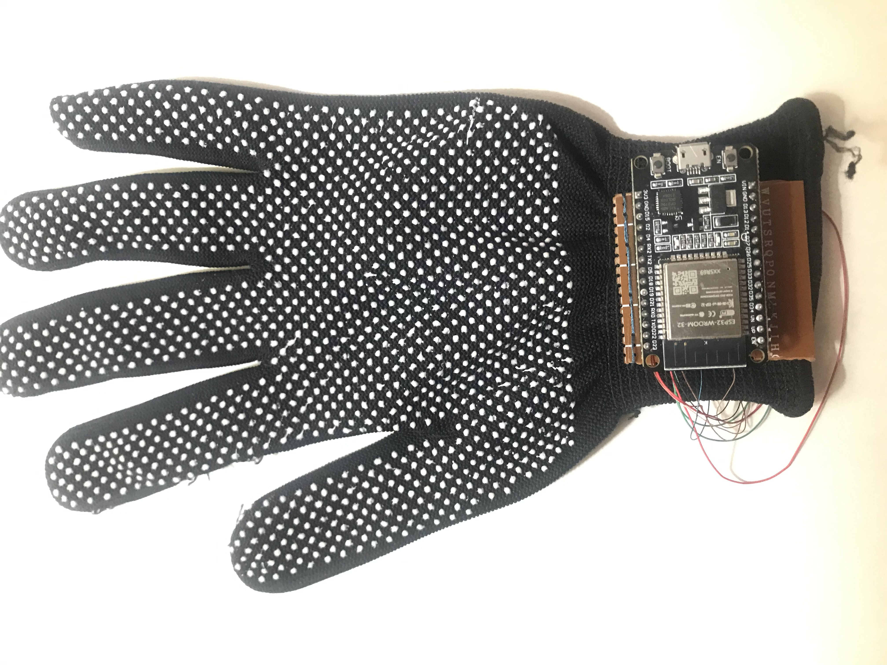
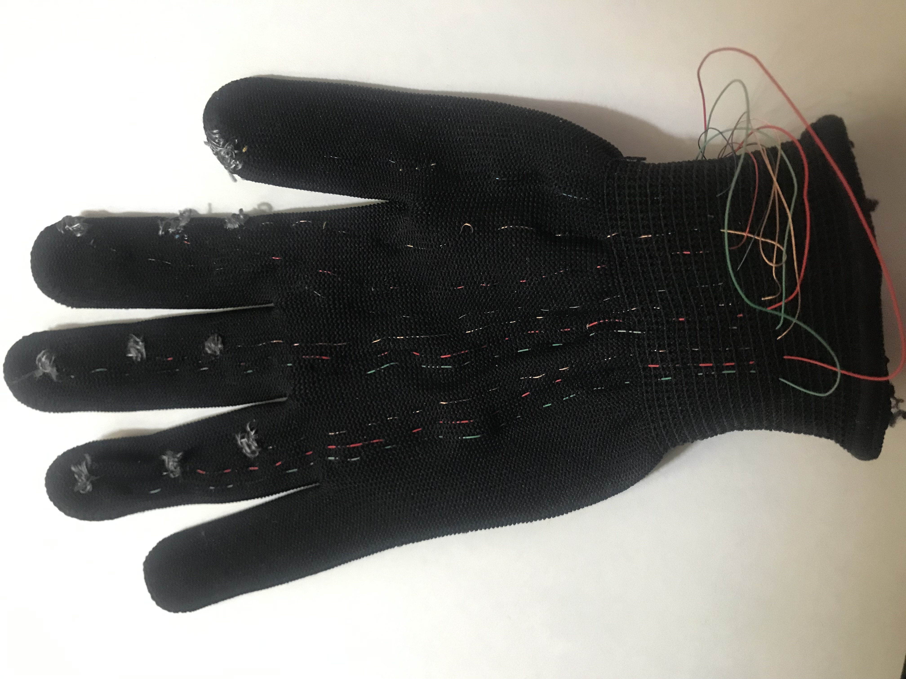
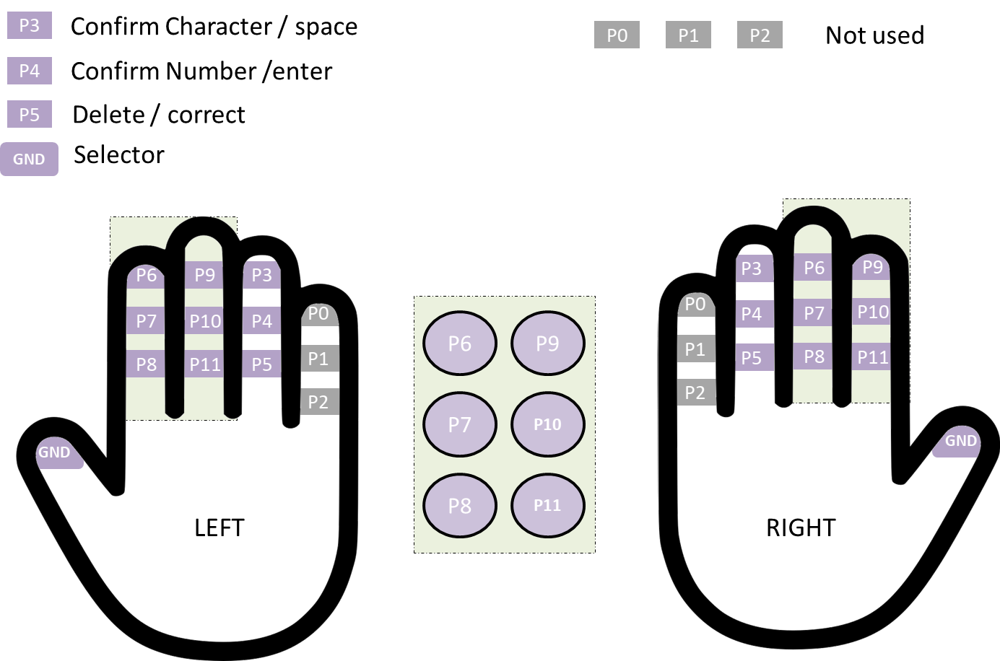

# Gloveraille version 3
The Gloveraille prototype version 3 uses an ESP32 development board instead of an Arduino pro mini. Therefore
the new prototype can be used as a Bluetooth keyboard.

## Make it yourself
To make you prototype you need:
* ESP32 dev board
* Headphone wires
* A glove
* A conductive thread or conductive fabric (or conductive tape as in version 1)

### Glove
You can follow the steps stated in the first version in order to build the prototype, however, instead of the
Arduino pro mini, we are using an ESP32, so you need to use the appropriate pins of the ESP32.
:heavy_exclamation_mark:: You might know that the ESP32 has pins that support touch sensors. However, the
prototype I build, the conductive thread is exposed in the inside and always connected to the skin.

### Code
The code is divided into tree file: `gloveraille.ino`, `functions.ino` and `config.ino`.
* **gloveraille.ino** : The main file, contains the declaration of variables and pins used of the ESP32.
* **functions.ino** : Contains the definition of used functions. 
* **config.ino** : Config file, used to map the ESP32 pins to each of the pads in the glove. The function of
  each pad is shown in the following picture:

### Test
The following video shows the prototype in action.

")